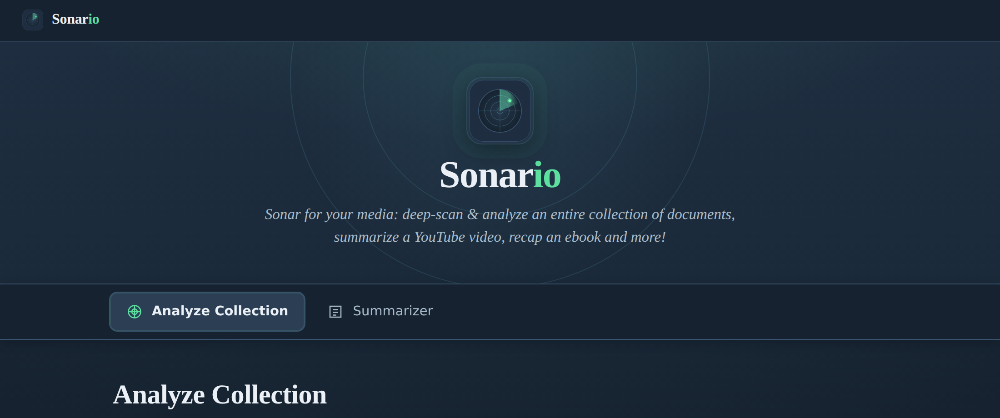
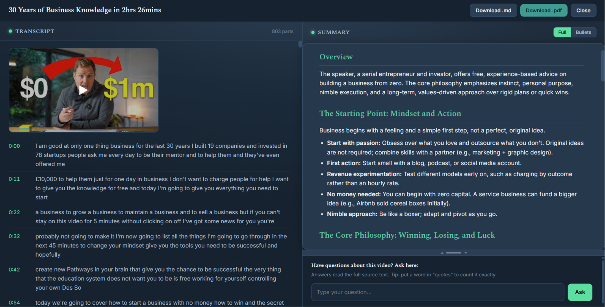

<div align="center">
  
</div>

---

Sonario is a desktop app with two jobs:

**Analyze Collection** points an AI at a folder of documents (Windows or Google
Drive), reads **every file**, and writes a one-page report on **what recurs**
across them. You pick an interpretation lens, or let **Auto** choose.

**Summarizer** turns a single source into a clear, skimmable summary you can
download: a Word doc, PDF, EPUB (whole book), text file, a YouTube link, or a web
page.

It runs as a small, **local-first** web app at `http://127.0.0.1:5005`. You bring
your own AI provider; the default, **Qwen3 8B**, runs fully on your own machine via
[Ollama](https://ollama.com) — no account, no API key, and nothing leaves your
computer. It's recommended for a typical gaming laptop (8GB GPU). If you'd rather
use a fast cloud model, Groq (Llama 4 Scout) is one dropdown click away — the same
free engine as the Sonario mobile app (bring your own free key).

<div align="center">
  
  <br>
  <em>The YouTube reader: timestamped transcript on the left, the summary (with an ask-a-question box) on the right.</em>
</div>

> **Setup and installation live in [BUILD.md](BUILD.md).** This README covers what
> Sonario does and how to use it. BUILD.md covers the `.bat` scripts, the local
> Ollama models, and the Google Drive setup.

## Contents

- [Quick start](#quick-start)
- [Analyze Collection](#analyze-collection)
- [Summarizer](#summarizer)
- [AI providers](#ai-providers)
- [Supported files](#supported-files)
- [Adding providers](#adding-providers)
- [Tested hardware](#tested-hardware)
- [Project layout](#project-layout)
- [Notes](#notes)
- [License](#license)

## Quick start

1. Follow **[BUILD.md](BUILD.md)** once to install (it is mostly double-clicking
   `setup.bat`).
2. Set up the default local model: double-click **`ollama_setup.bat`** (it installs
   [Ollama](https://ollama.com) if needed and pulls the models, once). This runs
fully on your machine with nothing sent to any provider. *Prefer a fast cloud model?*
Pick Groq from the dropdown and paste your free API key (console.groq.com).
3. Double-click **`run.bat`** to start the app, then open
   `http://127.0.0.1:5005` if it does not open by itself.
4. Use the top tabs to switch between **Analyze Collection** and **Summarizer**.
Both screens show results on screen with **Download .md / .pdf**.

> **Want to try Analyze right away?** The download includes a `Sample Documents`
> folder: 25 fictional text files (startup notes and journal entries) nested
> across subfolders. Point the **Windows folder** at it to see the analysis and
> the folder recursion in action. It is just a demo fixture; delete it whenever.

## Analyze Collection

Point Sonario at a folder and it reads every supported file, then writes a
one-page report on the patterns that recur across the whole collection. Tick
**Windows folder**, **Google Drive folder**, or **both**; selected sources are
scanned together into one report, and subfolders are read automatically.

<div align="center">
  
  <br>
  <em>Analyze Collection: pick your folders, choose a lens, and run.</em>
</div>

You choose an **interpretation lens** that changes what the AI looks for and how
the report reads:

| Lens | For | Report focus |
|---|---|---|
| **Auto** *(default)* | Mixed or unknown | Samples your docs and picks the best lens below |
| **Journal / Self-reflection** | Diaries, idea scribbles | Themes, what energizes vs weighs on you, journal prompts |
| **Work / Documentation** | Project notes, meetings, specs | Workstreams, progress, risks and blockers, decisions, open questions |
| **Research / Notes** | Literature and study notes | Concepts, supported findings, gaps, research questions |
| **General** | Anything | Neutral themes, notable points, questions to explore |

Every lens ends with a follow-up section tailored to it (journal prompts, open
questions, research questions, and so on), all built from what recurs.

After a report is ready you can **ask questions** about the documents in the box
at the bottom. It reads the full raw text, so it can answer specifics the summary
left out, and counting questions (put a word in "quotes") are answered exactly.

<div align="center">
  
  <br>
  <em>A finished report: recurring themes, the lens's sections, and a question box.</em>
</div>

### How Analyze works

1. **Lens.** If the mode is **Auto**, a quick pass over a sample picks the lens.
2. **Extract.** Walk the folder recursively and pull text from every file.
3. **Map.** One structured pass per document, framed by the lens. Cached to
   `cache/`, so it is resumable and re-runs are free.
4. **Reduce.** A pure-Python aggregation finds what *repeats* across documents.
5. **Synthesize.** Writes the page-long report in the lens's structure.
6. **Follow-ups.** A separate pass turns what recurs into the lens's follow-up
section.

The "what repeats" insight comes from step 4 counting across all your documents,
not from a single AI guess. Switching lens re-runs the map with different framing,
so delete `cache/` (or expect a fresh pass) when you change modes.

## Summarizer

Drop in a file or paste a link and get a structured, skimmable summary with
sub-headings, bullet points, and tables where the content supports them. A
**Detailed / Normal / Bullets** toggle switches between a long in-depth version,
the standard one-page notes, and a short outline.

<div align="center">
  
  <br>
  <em>The Summarizer: a file, ebook, YouTube link, or web page in; a clean summary out.</em>
</div>

| Source | Notes |
|---|---|
| **Files** | `.docx .pdf .txt .md .rtf`, images (OCR), and `.epub` whole books |
| **YouTube** | Summarized from captions, so even hour-plus videos work. Videos with captions disabled return a clear message (no audio download) |
| **Web pages** | Fetches the page and extracts the main article text |

For YouTube, Sonario opens a two-pane reader with the **timestamped transcript**
on the left and the summary on the right, plus an **ask box** for questions about
the video. You can drag the divider to resize the panes.

### How long can the input be?

There is no hard length limit. Long sources are split into sections, each is
summarized, and the section summaries are folded down (repeatedly if needed) until
a one-page summary fits. It will not crash on a 500-page book or a 2-hour video.

Two honest caveats:

- **Time locally.** On a typical 8GB gaming laptop, a 1-hour video is a few
minutes, a short book a few minutes, a 500-page book longer (hundreds of calls).
The Groq cloud engine is much faster but sends your text to Groq's servers.
- **Detail.** Folding a whole book into one page is inherently high level: you
get themes and arc, not chapter-by-chapter nuance. (The Summarizer's **Detailed**
view gives a much longer, in-depth version when you want more.)

If a section fails mid-run (for example a transient error during a long book),
that section is skipped and the summary still completes with a note that it may be
incomplete, so one flaky call does not waste a long run.

## AI providers

Both screens share the same providers. The default is free and fully local. Hover
any provider in the dropdown for a short description of when to use it.

| Provider | Cost | Where it runs | Needs |
|---|---|---|---|
| **Qwen3 8B** *(recommended, default)* | Free | **Fully local** on your GPU | [Ollama](https://ollama.com) + `ollama_setup.bat` |
| **Smart routing** | Free | Fully local on your GPU | [Ollama](https://ollama.com) + `ollama_setup.bat` (phi4-mini + qwen3:8b) |
| **Phi-4-mini** *(lightweight)* | Free | Fully local on your GPU | [Ollama](https://ollama.com) + `ollama pull phi4-mini` |
| **Ollama** *(any model)* | Free | Fully local on your machine | [Ollama](https://ollama.com) and any pulled model |
| **Groq — Llama 4 Scout** | Free (bring your own key) | Cloud | Free API key from console.groq.com |

All speak the OpenAI-compatible format, so switching is just a dropdown. Advanced
users can add their own in [`models.json`](#adding-providers).

> **Qwen3 8B (the default).** One strong local model that does every step at full
> quality. It's the best all-round choice for a typical 8GB gaming laptop — fully
> private, no account, can't be rate-limited. Run **`ollama_setup.bat`** once.

> **Smart routing (optional).** Splits the work between two local models: the
> lightweight **phi4-mini** for the heavy repetitive parts (per-chunk summaries,
> classification) and **qwen3:8b** for the final write-up. This is lighter on very
> long jobs, but the chunk-level work is lower quality than running Qwen3 8B for
> everything, and on an 8GB GPU the two models can't both stay resident so Ollama
> swaps between them. Use it if long-job speed matters more than maximum quality.

> **Phi-4-mini (lightweight).** The smallest, fastest local model. Best for weaker
> or CPU-only machines, or when speed matters more than depth. Lower quality on
> long or complex sources.

> **Groq — Llama 4 Scout (cloud).** The fast path, and the same engine as the
> Sonario mobile app. Summarizes long videos and whole books in one pass (128k
> context) in seconds, with no local GPU load. Free to use with your own API key
> from [console.groq.com](https://console.groq.com) (no credit card). The trade-off
> is privacy: your text is sent to Groq's servers, so use a local model for
> anything sensitive. See BUILD.md for the one-minute key setup.

> **A note on privacy.** Sonario runs locally, but where your *text* goes depends
> on the provider. With the **local** models (Qwen3 8B, Phi-4-mini, smart routing,
> or any Ollama model) everything stays on your machine. With a **cloud** provider
> (Groq), the text of your documents is sent to that provider to generate
> the result. If a source is sensitive, use a local model. Sonario shows a heads-up
> if you pair Google Drive with a cloud provider.

## Supported files

`.txt .md .rtf .docx .pdf .epub` plus **scanned PDFs and images** via OCR.
`setup.bat` installs the OCR tools (Tesseract and Poppler) for you; see BUILD.md
for the manual links. Without them, everything except scanned images still works.

## Adding providers

Edit **`models.json`** to add any OpenAI-compatible endpoint, no code changes.
Restart and it appears in both dropdowns.

```json
{
  "providers": {
    "lmstudio": {
      "label": "LM Studio (free, local)",
      "base_url": "http://localhost:1234/v1",
      "model": "local-model",
      "needs_key": false,
      "min_interval": 0.0,
      "note": "Start LM Studio's local server and load a model first."
}
}
}
```

## Tested hardware

Sonario was built and tested on this machine. It is not a minimum spec, just the
reference setup the defaults are tuned for:

| Component | Spec |
|---|---|
| **OS** | Windows 11 |
| **GPU** | NVIDIA RTX 5060 Laptop GPU (8 GB VRAM) |
| **RAM** | 16 GB |
| **Python** | 3.10+ |

What this means for the providers:

- **Cloud provider** (Groq) doesn't depend on
your hardware at all — the work happens on their servers. Any modern PC is fine.
- **Local default (smart routing: phi4-mini + qwen3:8b)** needs ~8 GB total for the
two models. On the 8 GB GPU above they can't both stay resident, so Ollama swaps
between them as the job moves between roles — it works, but adds a short pause on
each swap, so long jobs aren't instant. A GPU with more VRAM (12 GB+) would hold
both at once and run much faster.
- **Want to avoid swapping?** Pick a single-model local provider (Qwen3 8B on its
own, or the lighter Phi-4-mini) so only one model loads — no swap pauses, at the
cost of either depth (Phi-4-mini) or the fast/slow split.

## Project layout

```
app.py Flask server: Analyze job + Summarizer job
providers.py one OpenAI-compatible interface for every LLM
extract.py recursive walk + text extraction (incl. OCR)
modes.py interpretation lenses (auto/journal/work/research/general)
sources.py Summarizer inputs: YouTube / web page / EPUB / files
pipeline.py map / reduce / synthesize / prompts / summarize
gdrive.py Google Drive web OAuth (read-only, isolated)
export.py Markdown + PDF export
models.json add custom providers without editing code
static/ single-file SPA + icons
*.bat setup and launch scripts (see BUILD.md)
```

## Notes

- Everything runs on `127.0.0.1`: single user, your machine only.
- `cache/`, `output/`, and `credentials/` stay local and are git-ignored.
- Delete `cache/` to force a fresh re-analysis.

## License

MIT &copy; pgotta. See [LICENSE](LICENSE).

Local models run through [Ollama](https://ollama.com) and the cloud option
(Groq) is a third-party service with its own license and terms;
Sonario just talks to it over the standard OpenAI-compatible API.
