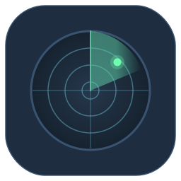
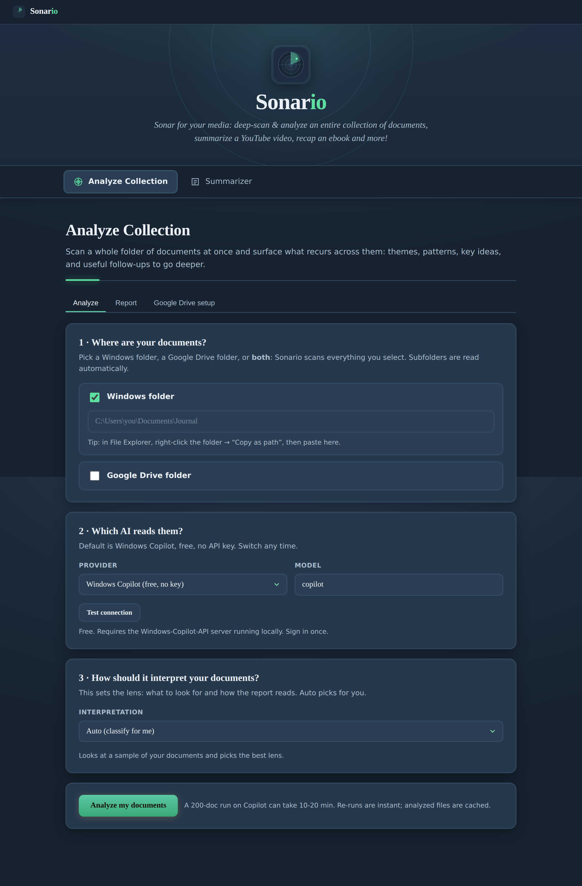
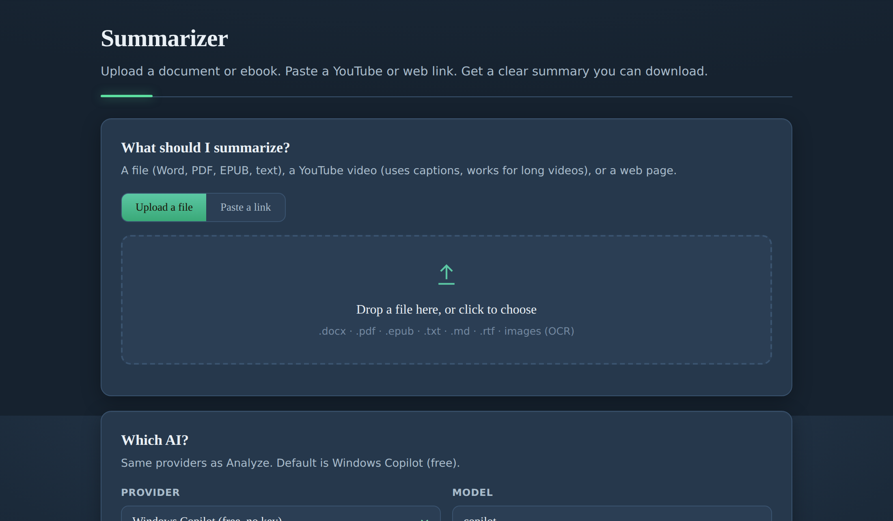

<div align="center">
  
  <h1>Sonar<span>io</span></h1>
  <p><em>Sonar for your media: deep-scan and analyze an entire collection of documents, summarize a YouTube video, recap an ebook, and more.</em></p>
  <p>
    
    
  </p>
</div>

---

Sonario is a desktop app with two jobs:

**Analyze Collection** points an AI at a folder of documents (Windows or Google
Drive), reads **every file**, and writes a one-page report on **what recurs**
across them. You pick an interpretation lens, or let **Auto** choose.

**Summarizer** turns a single source into a clear, skimmable summary you can
download: a Word doc, PDF, EPUB (whole book), text file, a YouTube link, or a web
page.

It runs as a small local web app at `http://127.0.0.1:5005`. You bring your own
AI provider; the default is **DeepSeek**, which is free, fast, and needs no API
key.

<div align="center">
  
  
</div>

> **Setup and installation live in [BUILD.md](BUILD.md).** This README covers what
> Sonario does and how to use it. BUILD.md covers the `.bat` scripts, the free
> Windows Copilot backend, and the Google Drive setup.

## Quick start

1. Follow **[BUILD.md](BUILD.md)** once to install (it is mostly double-clicking
   `setup.bat`).
2. Run **`deepseek_setup.bat`** once to set up the free default provider (it
   downloads the bridge, signs you into DeepSeek once, and starts it in the
   background). Prefer Windows Copilot instead? Run `copilot_setup.bat` and pick
   it from the provider dropdown.
3. Double-click **`run.bat`** to start the app, then open
   `http://127.0.0.1:5005` if it does not open by itself.
4. Use the top tabs to switch between **Analyze Collection** and **Summarizer**.

Both screens show results on screen with **Download .md / .pdf**.

> **Want to try Analyze right away?** The download includes a `Sample Documents`
> folder: 25 fictional text files (startup notes and journal entries) nested
> across subfolders. Point the **Windows folder** at it to see the analysis and
> the folder recursion in action. It is just a demo fixture; delete it whenever.

## Analyze Collection

Point Sonario at a folder and it reads every supported file, then writes a
one-page report on the patterns that recur across the whole collection. Tick
**Windows folder**, **Google Drive folder**, or **both**; selected sources are
scanned together into one report, and subfolders are read automatically.

You choose an **interpretation lens** that changes what the AI looks for and how
the report reads:

| Lens | For | Report focus |
|---|---|---|
| **Auto** *(default)* | Mixed or unknown | Samples your docs and picks the best lens below |
| **Journal / Self-reflection** | Diaries, idea scribbles | Themes, what energizes vs weighs on you, journal prompts |
| **Work / Documentation** | Project notes, meetings, specs | Workstreams, progress, risks and blockers, decisions, open questions |
| **Research / Notes** | Literature and study notes | Concepts, supported findings, gaps, research questions |
| **General** | Anything | Neutral themes, notable points, questions to explore |

Every lens ends with a follow-up section tailored to it (journal prompts, open
questions, research questions, and so on), all built from what recurs.

After a report is ready you can **ask questions** about the documents in the box
at the bottom. It reads the full raw text, so it can answer specifics the summary
left out, and counting questions (put a word in "quotes") are answered exactly.

### How Analyze works

1. **Lens.** If the mode is **Auto**, a quick pass over a sample picks the lens.
2. **Extract.** Walk the folder recursively and pull text from every file.
3. **Map.** One structured pass per document, framed by the lens. Cached to
   `cache/`, so it is resumable and re-runs are free.
4. **Reduce.** A pure-Python aggregation finds what *repeats* across documents.
5. **Synthesize.** Writes the page-long report in the lens's structure.
6. **Follow-ups.** A separate pass turns what recurs into the lens's follow-up
   section.

The "what repeats" insight comes from step 4 counting across all your documents,
not from a single AI guess. Switching lens re-runs the map with different framing,
so delete `cache/` (or expect a fresh pass) when you change modes.

## Summarizer

Drop in a file or paste a link and get a structured, skimmable summary with
sub-headings, bullet points, and tables where the content supports them. A
**Full / Bullets** toggle switches between the full notes and a shorter outline.

| Source | Notes |
|---|---|
| **Files** | `.docx .pdf .txt .md .rtf`, images (OCR), and `.epub` whole books |
| **YouTube** | Summarized from captions, so even hour-plus videos work. Videos with captions disabled return a clear message (no audio download) |
| **Web pages** | Fetches the page and extracts the main article text |

For YouTube, Sonario opens a two-pane reader with the **timestamped transcript**
on the left and the summary on the right, plus an **ask box** for questions about
the video. You can drag the divider to resize the panes.

### How long can the input be?

There is no hard length limit. Long sources are split into sections, each is
summarized, and the section summaries are folded down (repeatedly if needed) until
a one-page summary fits. It will not crash on a 500-page book or a 2-hour video.
Two honest caveats:

- **Time on Copilot.** Copilot is paced (about 4s per call, one at a time). A
  1-hour video is roughly 1 to 2 minutes; a short book a few minutes; a 500-page
  book about 15 to 20 minutes and hundreds of calls. Cloud providers
  (OpenAI / Gemini) are much faster.
- **Detail.** Folding a whole book into one page is inherently high level: you
  get themes and arc, not chapter-by-chapter nuance.

If a section fails mid-run (for example a transient Copilot error during a long
book), that section is skipped and the summary still completes with a note that it
may be incomplete, so one flaky call does not waste a long run.

## AI providers

Both screens share the same providers. The default is free.

| Provider | Cost | Where it runs | Needs |
|---|---|---|---|
| **DeepSeek** / **DeepSeek Expert** *(default)* | Free, no key | Your normal DeepSeek account (cloud) | `deepseek_setup.bat`, see BUILD.md |
| **Windows Copilot** | Free, no key | Your normal Copilot account (cloud) | `copilot_setup.bat`, see BUILD.md |
| **Ollama** | Free | Fully local on your machine | [Ollama](https://ollama.com) and a pulled model |
| **OpenAI** | A few cents to ~$2 per 200 docs | Cloud | API key |
| **Gemini** | Free tier or key | Cloud | API key |

All speak the OpenAI-compatible format, so switching is just a dropdown. Add your
own in [`models.json`](#adding-providers) (ships with LM Studio and OpenRouter).

> **DeepSeek** works just like the Copilot bridge: a small local server
> ([Deepseek-API](https://github.com/sums001/Deepseek-API) by sums001) turns your
> free signed-in DeepSeek account into a local API. Run `deepseek_setup.bat` once
> (it downloads the bridge, signs you in, and starts it on `localhost:8001` so it
> never clashes with Copilot on `8000`). Pick **DeepSeek** for the fast model or
> **DeepSeek Expert** for the stronger, slower one. Because it's a separate account
> from Copilot, it's also a handy fallback if your Copilot session is rate-limited.

> **A note on privacy.** Sonario runs locally, but where your *text* goes depends
> on the provider. With **Ollama** everything stays on your machine. With
> **Windows Copilot** or any cloud provider, the text of your documents is sent to
> that provider to generate the result. If a source is sensitive, use Ollama.
> Sonario shows a heads-up if you pair Google Drive with the Copilot bridge.

## Supported files

`.txt .md .rtf .docx .pdf .epub` plus **scanned PDFs and images** via OCR.
`setup.bat` installs the OCR tools (Tesseract and Poppler) for you; see BUILD.md
for the manual links. Without them, everything except scanned images still works.

## Adding providers

Edit **`models.json`** to add any OpenAI-compatible endpoint, no code changes.
Restart and it appears in both dropdowns.

```json
{
  "providers": {
    "lmstudio": {
      "label": "LM Studio (free, local)",
      "base_url": "http://localhost:1234/v1",
      "model": "local-model",
      "needs_key": false,
      "min_interval": 0.0,
      "note": "Start LM Studio's local server and load a model first."
    }
  }
}
```

## Project layout

```
app.py          Flask server: Analyze job + Summarizer job
providers.py    one OpenAI-compatible interface for every LLM
extract.py      recursive walk + text extraction (incl. OCR)
modes.py        interpretation lenses (auto/journal/work/research/general)
sources.py      Summarizer inputs: YouTube / web page / EPUB / files
pipeline.py     map / reduce / synthesize / prompts / summarize
gdrive.py       Google Drive web OAuth (read-only, isolated)
export.py       Markdown + PDF export
models.json     add custom providers without editing code
static/         single-file SPA + icons
*.bat           setup and launch scripts (see BUILD.md)
```

## Notes

- Everything runs on `127.0.0.1`: single user, your machine only.
- `cache/`, `output/`, and `credentials/` stay local and are git-ignored.
- Delete `cache/` to force a fresh re-analysis.

## License

MIT &copy; pgotta. See [LICENSE](LICENSE).
