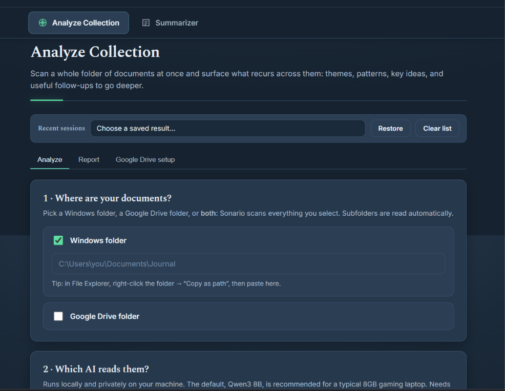
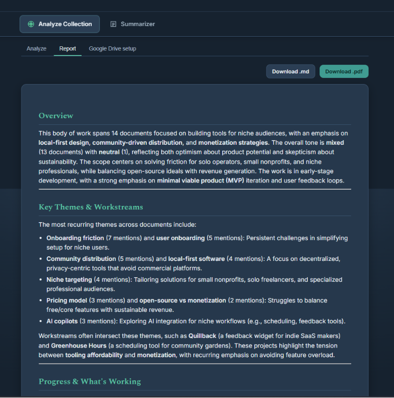
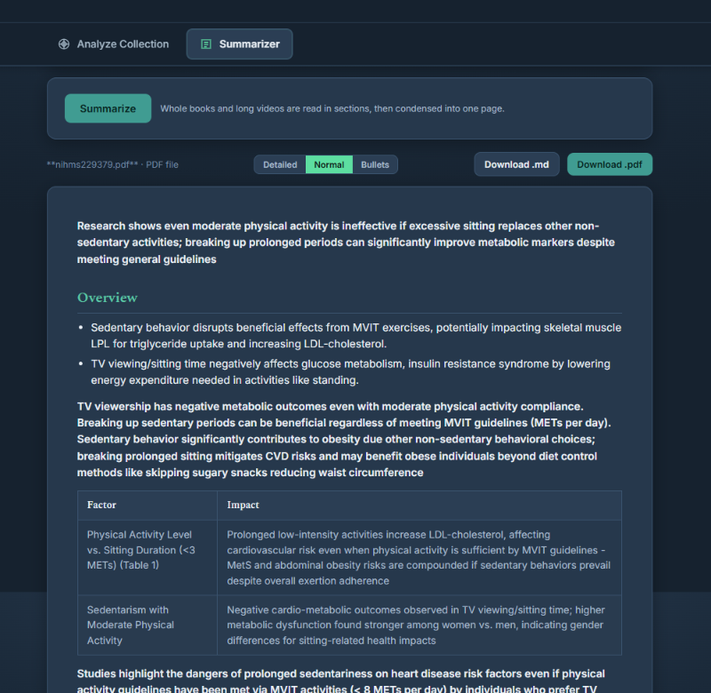

<div align="center">
  
</div>

---

# Sonario

Sonario is a Windows desktop app with two jobs:

- **Analyze Collection** reads every supported file in one or more Windows or Google Drive folders and writes a report about what recurs across the collection.
- **Summarizer** turns a document, EPUB, YouTube link, or web page into a clear summary with downloadable Markdown and PDF output.

The app runs locally at `http://127.0.0.1:5005`. The default provider,
**Qwen3.5 9B through Ollama**, runs on your own machine with no account or API key.
The optional cloud provider is **Groq – Qwen 3.6 27B**, pinned to
`qwen/qwen3.6-27b`.

<div align="center">
  
  <br>
  <em>Timestamped transcript on the left, summary and follow-up questions on the right.</em>
</div>

> Installation, launcher reconstruction, release packaging, and Google Drive setup
> are documented in **[BUILD.md](BUILD.md)**.

## Current release

This repository reflects the currently tested Windows release:

- Groq uses **Qwen 3.6 27B**; the retired Scout-era Groq preset is not used anywhere.
- Groq structured calls use JSON Object Mode with larger retry budgets.
- If a model still returns malformed or truncated JSON, Sonario repairs or recovers the result instead of dropping the document. The progress log marks this as **`JSON recovered`**.
- Sonario opens in a dedicated maximized Edge or Chrome app window with browser sign-in and synchronization disabled for that private profile.
- Closing the Sonario window with **X** stops the exact Flask backend that opened it. `stop.bat` remains the manual fallback.
- Google Drive access is optional, read-only, and starts only after the user deliberately connects or analyzes a Drive folder.

The X-close path was verified with a Windows shutdown diagnostic: the watcher exited,
port 5005 stopped listening, and no Sonario `app.py` process remained. Old
`TIME_WAIT` rows in `netstat` are normal closed connections, not a running server.

## Quick start

### Release ZIP

1. Extract the complete Sonario release ZIP into an empty folder.
2. Double-click **`setup_all.bat`** once.
3. Launch Sonario from the desktop shortcut created by setup.
4. Close the dedicated Sonario window with **X** when finished.

The release ZIP contains the local BAT launchers. BAT files are intentionally not
stored in GitHub; their authoritative contents are kept in
**[BUILD.md](BUILD.md#full-bat-launcher-contents)**.

### Git clone or GitHub source archive

A clone does not contain BAT files. Recreate the required launchers from BUILD.md,
save them with CRLF line endings, then run `setup_all.bat`.

> **Demo collection:** `Sample Documents/` contains 25 fictional nested text files
> for testing recursive collection analysis. It contains no personal data.

## Analyze Collection

Select a **Windows folder**, **Google Drive folder**, or both. Sonario walks all
subfolders, extracts supported text, maps each document into a structured note,
counts recurring patterns in Python, and synthesizes the final report.

<div align="center">
  
</div>

### Interpretation lenses

| Lens | Intended material | Report focus |
|---|---|---|
| **Auto** | Mixed or unknown | Samples documents and chooses the best lens |
| **Journal / Self-reflection** | Journals and personal notes | Themes, emotional weight, energy, prompts |
| **Work / Documentation** | Project notes, meetings, specifications | Workstreams, progress, decisions, risks, open questions |
| **Research / Notes** | Study or research material | Concepts, findings, gaps, research questions |
| **General** | Anything else | Neutral themes, notable points, questions to explore |

### Analysis pipeline

1. **Lens selection:** Auto samples the collection and chooses a lens.
2. **Extraction:** Files are discovered recursively and converted to text.
3. **Map:** Each document receives a structured analysis. Results are cached.
4. **Recovery:** A malformed Groq JSON response gets a larger JSON retry, local JSON repair, a compact text-format recovery, and finally a local fallback. A document is not discarded solely because cloud formatting failed.
5. **Reduce:** Python counts patterns recurring across multiple documents.
6. **Synthesize:** The selected lens shapes the final report and follow-up questions.

A recovered item appears in progress output as:

```text
[5/9] analyzed example.txt (JSON recovered)
```

<div align="center">
  
</div>

## Summarizer

Drop in a supported file or paste a link. Sonario produces Detailed, Normal, and
Bullets views. Long sources are divided into sections and folded down until the
result fits; a single failed section is noted rather than aborting the entire job.

<div align="center">
  
</div>

| Source | Behavior |
|---|---|
| **Files** | `.txt`, `.md`, `.rtf`, `.docx`, `.pdf`, `.epub`, and OCR-supported images |
| **YouTube** | Uses available captions and provides a timestamped two-pane reader |
| **Web pages** | Extracts the main article text |

## AI providers

| Provider | Cost | Location | Notes |
|---|---:|---|---|
| **Qwen3.5 9B** | Free | Local | Recommended default; about 6.6 GB through Ollama |
| **Smart routing** | Free | Local | Qwen3.5 4B for repetitive work and 9B for final synthesis |
| **Qwen3.5 4B** | Free | Local | Faster and lighter, with lower quality on complex sources |
| **Ollama – any model** | Free | Local | Enter any model already pulled into Ollama |
| **Groq – Qwen 3.6 27B** | Free tier, own key | Cloud | Pinned to `qwen/qwen3.6-27b`; text is sent to Groq |

Groq requests use conservative pacing, live reset headers, non-thinking mode, and
`max_completion_tokens`. Structured document mapping uses JSON Object Mode and a
layered recovery path for truncated or malformed responses.

### Privacy

- Local Ollama providers keep document text on the computer.
- Groq sends the text needed for the selected job to Groq's servers.
- Google Drive is read-only. Sonario does not silently authorize an account; OAuth is allowed only during an explicit connect/setup action.
- Remembered API keys are stored locally in plain text under the gitignored `credentials/` directory.

## Google Drive

Google Drive is optional. Sonario requests read-only access using a personal Google
OAuth desktop client. Normal app startup checks only local credential state; it does
not open an OAuth prompt or refresh a token unless the user explicitly connects or
starts a Drive-backed job. Full setup steps are in BUILD.md.

## Supported files

`.txt`, `.md`, `.rtf`, `.docx`, `.pdf`, `.epub`, plus scanned PDFs and images via
Tesseract and Poppler OCR.

## Adding providers

Add an OpenAI-compatible provider to `models.json`, restart Sonario, and it appears
in the provider dropdowns.

```json
{
  "providers": {
    "lmstudio": {
      "label": "LM Studio (free, local)",
      "base_url": "http://localhost:1234/v1",
      "model": "local-model",
      "needs_key": false,
      "min_interval": 0.0,
      "note": "Start LM Studio's local server and load a model first."
    }
  }
}
```

## Tested hardware

The defaults were tested on Windows 11 with an NVIDIA RTX 5060 Laptop GPU
(8 GB VRAM), 16 GB RAM, and Python 3.12. This is a reference system, not a minimum
requirement. Groq does not depend on local GPU performance.

## Project layout

```text
app.py                       Flask server and API routes
pipeline.py                  mapping, reduction, synthesis, recovery, summarization
providers.py                 Ollama/Groq/custom provider interface and rate limiting
extract.py                   recursive file extraction and OCR
sources.py                   files, EPUB, YouTube, and web inputs
modes.py                     interpretation lenses
export.py                    Markdown and PDF export
gdrive.py                    optional read-only Google Drive OAuth
keystore.py                  opt-in local API-key storage
sysmon.py                    local CPU/RAM/GPU monitor
sonario_window.ps1           dedicated app window and X-close watcher
stop_sonario.ps1             process-specific manual shutdown
create_sonario_shortcut.ps1  desktop shortcut creation
sonario_launcher.vbs         hidden desktop-launch bridge
static/                      interface and icons
tests/                       provider and recovery regression tests
BUILD.md                     installation, packaging, and full BAT contents
```

The BAT launchers shown in BUILD.md are added only to downloadable Windows release
ZIPs. They must remain absent from Git history.

## Repository policy

- No `*.bat` file may be committed.
- `.gitignore` blocks all BAT files with no exceptions.
- CI fails if a tracked BAT file appears or if BUILD.md stops documenting a required launcher.
- Runtime state, logs, credentials, API keys, caches, output, browser profiles, PID files, and diagnostics are ignored.

## License

MIT © pgotta. See [LICENSE](LICENSE).

Ollama, local models, Groq, Google APIs, Tesseract, Poppler, YouTube, and other
third-party services or tools retain their own licenses and terms.
